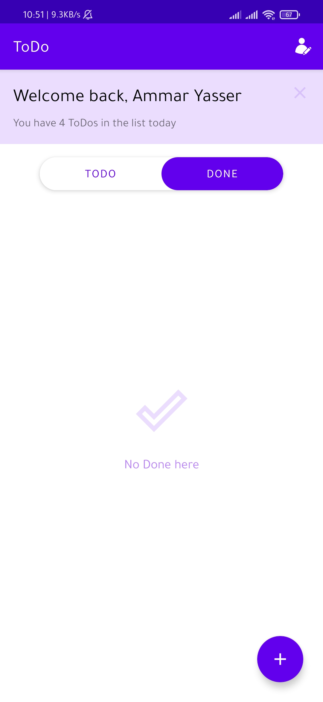
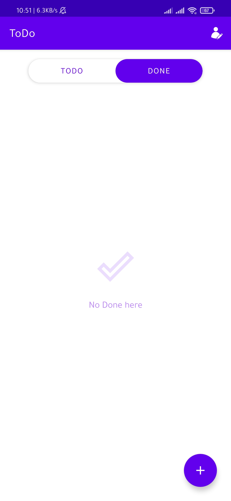
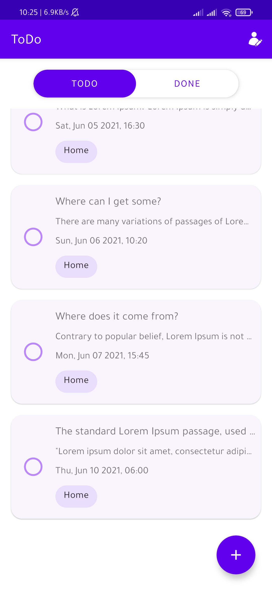
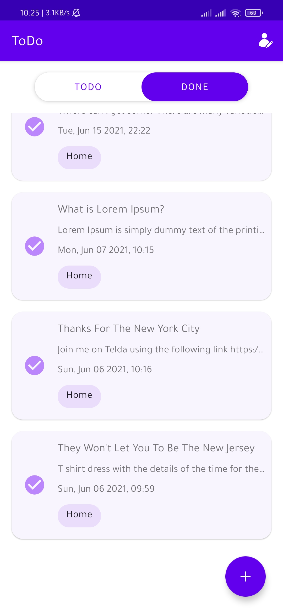

# ToDo

###  Description

Simple android app whose functionality is to track and filter your daily To-Do.

### Key highlights

- Room
- Coroutines
- MVVM
- `LiveData`, `MutableLiveData`
- androidx.ViewModel
- Data / View Binding
- Fragments
    - `BottomSheet`
    - `AlertDialog`
- Views
    - `ConstraintLayout`
    - `RecyclerView`
    - `CardView`
- Menus

### Collaboration

UI designed using **Adobe XD** by [Abouelkhair Rady ](https://www.behance.net/Abou-Elkhair)

### Screenshots

    
    
     
    
    
     
    
    
     
    
     
    
    
     
    
    
     
    
    
    

