# ToDo

###  Description

A dual-themed simple android app whose functionality is to track and filter your daily To-Do.

### Key highlights

- Room
- Coroutines
- MVVM
- `LiveData`, `MutableLiveData`
- androidx.ViewModel
- Data / View Binding
- Fragments
    - `BottomSheet`
    - `AlertDialog`
- Views
    - `ConstraintLayout`
    - `RecyclerView`
    - `CardView`
- Menus
- MaterialComponents

### Collaboration

UI designed using **Adobe XD** by [Abouelkhair Rady](https://www.behance.net/Abou-Elkhair)

---

***
If you want to give it a try, you can download and install the [ToDo.apk](https://github.com/AmmarYasserAllaiThy/ToDo/releases/download/1.1/ToDo.apk) on your phone.
***

---

## *Light theme*

    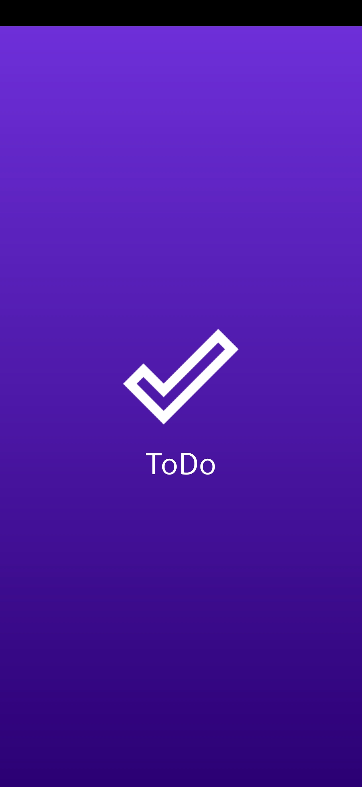
    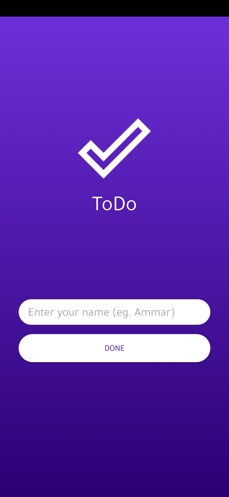
     
    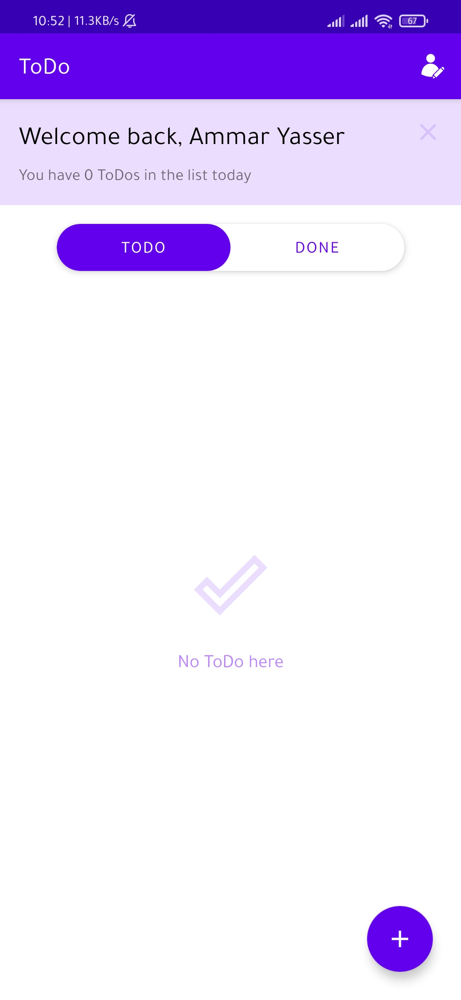
    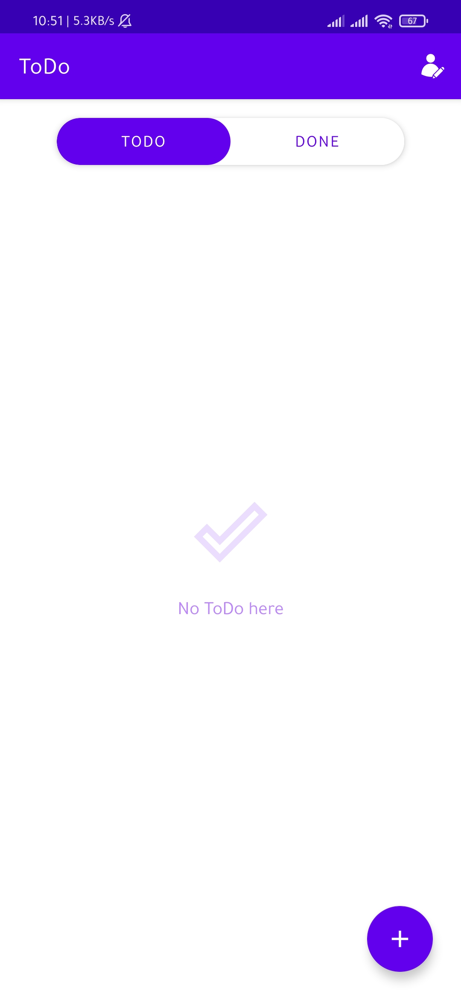
     
    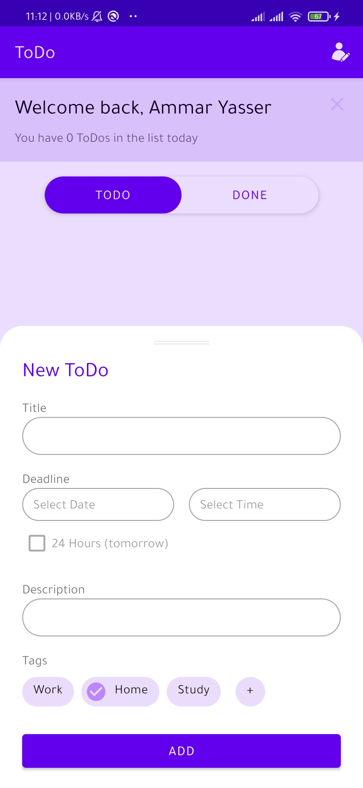
    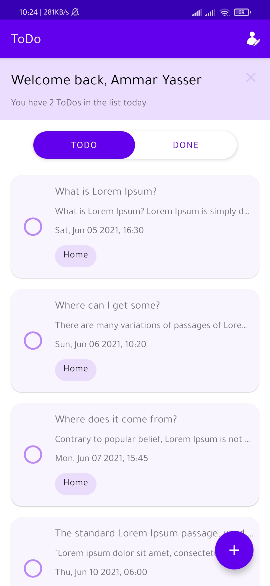
    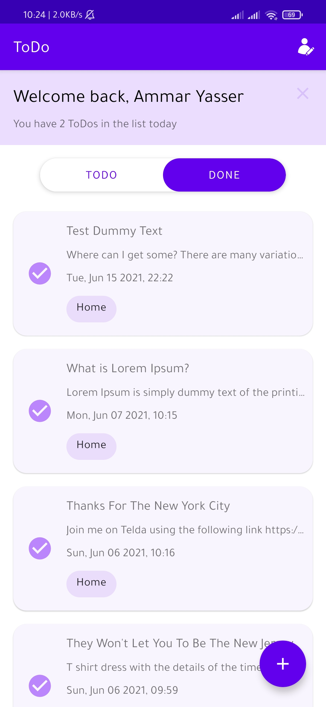
     
    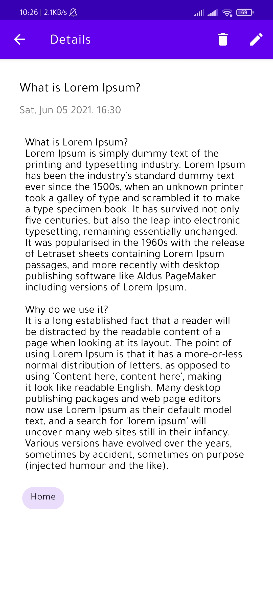
    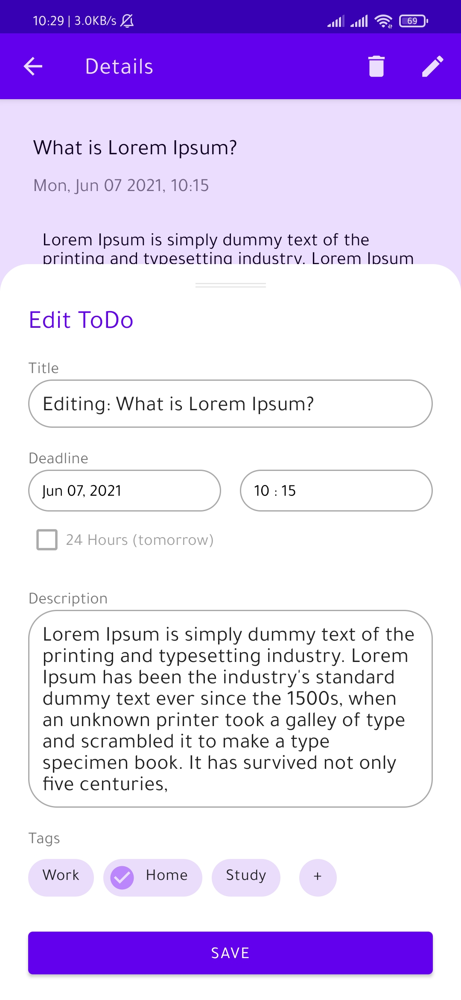
    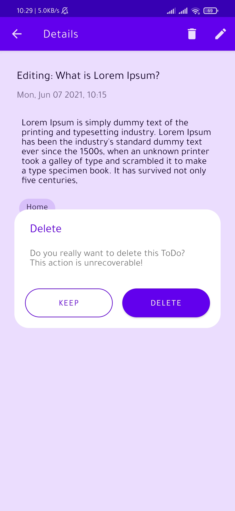

## *Dark theme*

    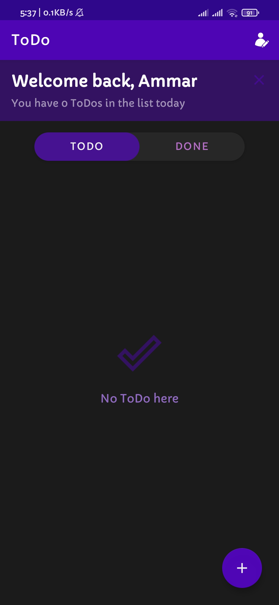
    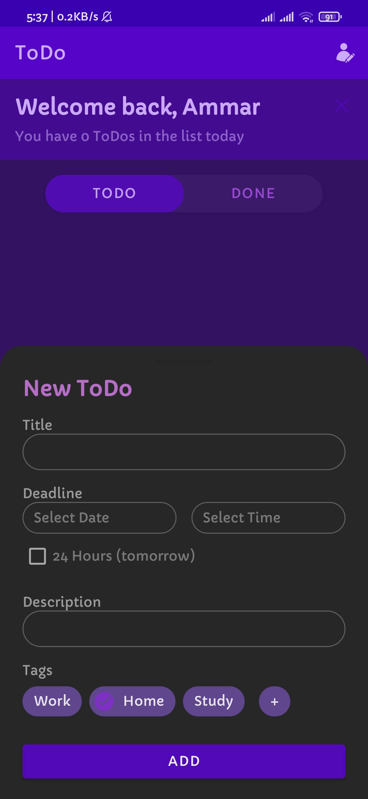
    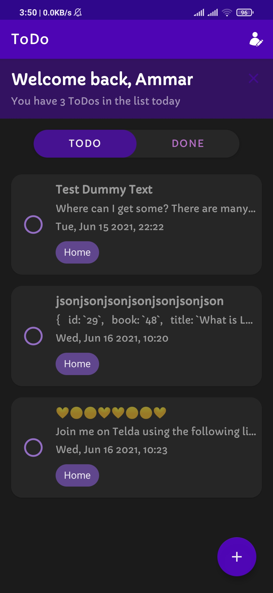
     
    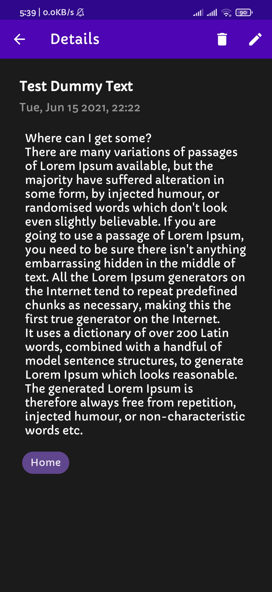
    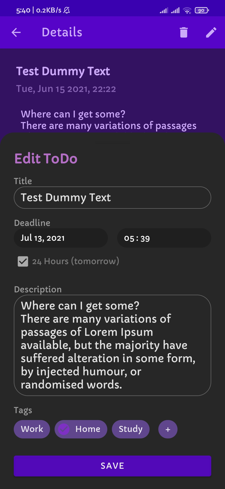
    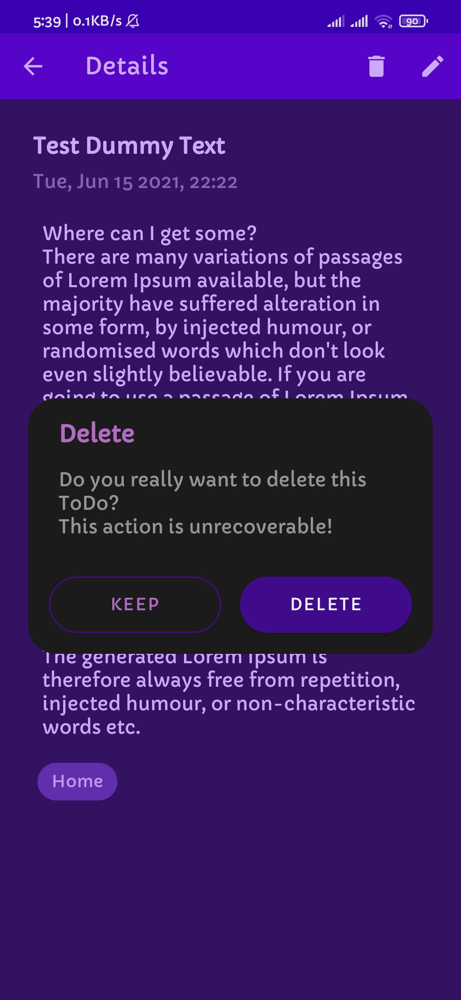

